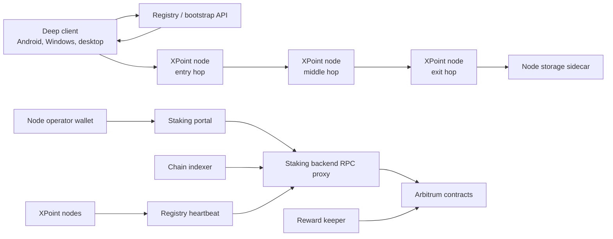

# Architecture

XPoint is split into client, node, staking, and operations planes.

## Client plane

Deep clients use the registry/bootstrap data to learn about available nodes and their signed transport profiles. A client selects a multi-hop path and sends encrypted envelopes through the route. Each relay only learns the next hop and enough transport information to forward the envelope.

## Node plane

`xnode` is the production node runtime. It owns:

- node identity and signed relay contact publication;
- Session-compatible path and RPC semantics;
- VLESS/Xray ingress transport;
- heartbeat publication to the registry;
- staking registration material, including Ed25519 and BLS public data;
- BLS12-381 quorum signatures for staking backend requests.

The Xray/VLESS layer is a transport implementation detail. The protocol behavior above transport remains Session-style: signed relay contacts, multi-hop routing, and node-selected storage delivery.

## Staking plane

The production staking contracts are deployed on Arbitrum One. They track XPNT stake, active service-node public keys, contributors, reward accounting, exit requests, and liquidation conditions.

The staking backend indexes chain state and asks active obligation-eligible nodes for BLS signatures. Registry endpoints are used as a network address cache, not as the authority for node membership.

## Operations plane

The operations plane includes:

- registry API and bootstrap endpoints;
- staking portal and backend API;
- chain indexer and reward checkpoint keeper;
- storage/file/avatar/push infrastructure;
- Docker images, release gates, monitoring, alerting, and runbooks.

These components must be deployed, monitored, and backed up like production infrastructure.

